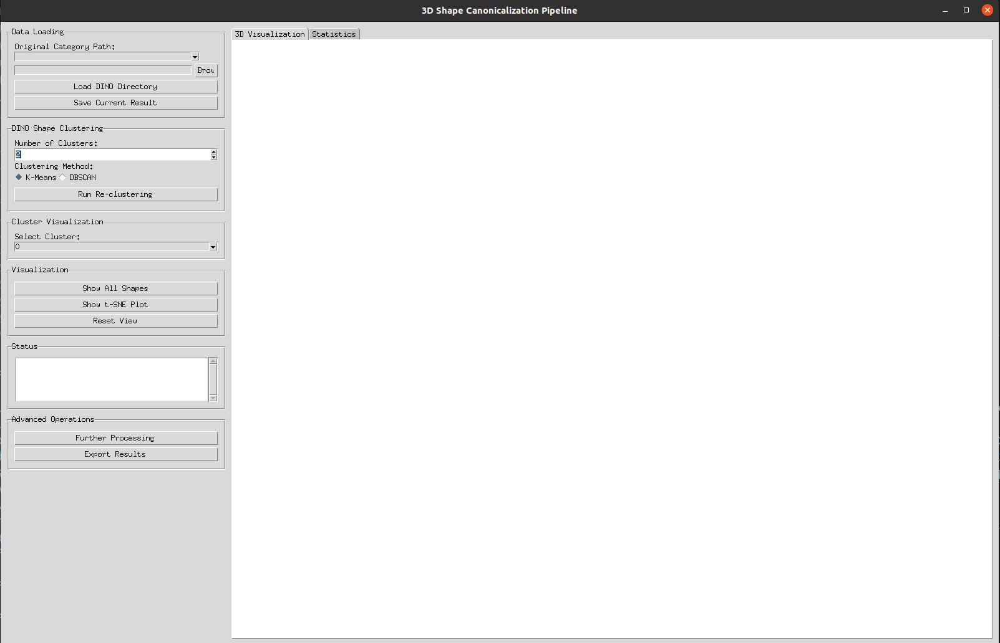

# shape_canonicalization_gui_tool
shape_canonicalization_gui_tool

<!-- // how to add picture here? (/home/lei/Documents/Dataset/Cannonicalization_stats/UniOrient/pictures/GUI_pic.png) -->

## conda env configure

## splitted categories: data_downloader/split
###  add unzip script : data_downloader/unzip_files_flat.py

## step 0: data_downloader/download_list.py
## step 1: code/test_v1.py
### you set batch_size parameter in function fuse_feature_rgbd_batch in helper.feat_pc_modules
## step 2: GUI/shape_gui.py