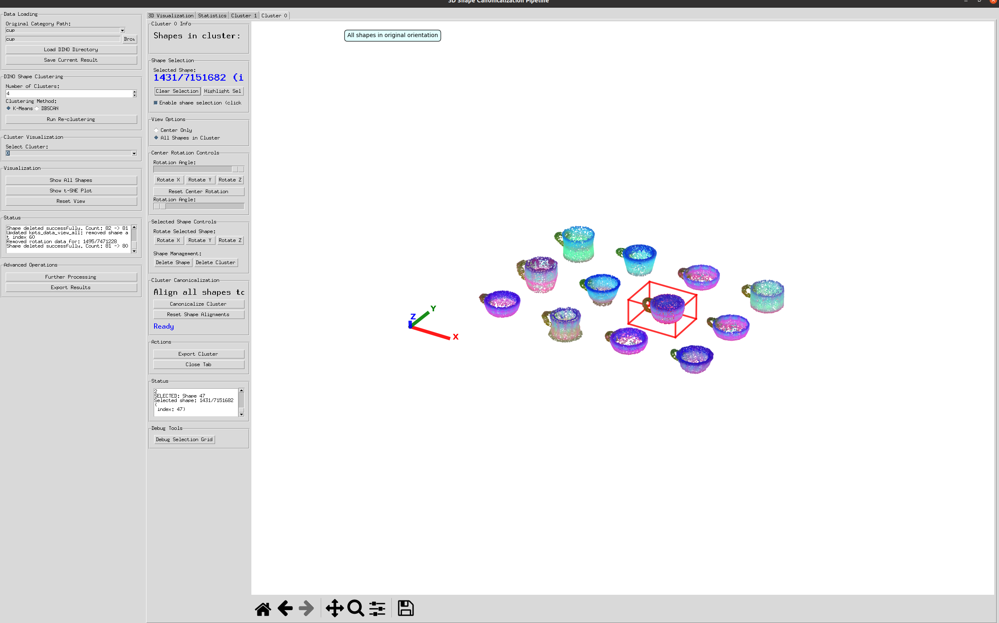

# **UniOrient: Large Scale Canonicalized 3D Shape Dataset & GUI Tool**

[](LICENSE)
[]()
[]()

---

## 📗 Overview
We introduce **UniOrient**, a substantial **canonicalized 3D shape** dataset featuring **diverse object categories**, **large scale**, and **rich annotations** (language and image). Alongside the dataset, we release a **semi‑automatic, easy‑to‑use canonicalization GUI tool** for aligning shapes to a consistent, category‑aware canonical frame.

> This repo hosts the **Shape Canonicalization GUI** plus helper scripts for downloading data, preparing splits, and running our baseline pipeline.

---

## ✨ News
- **2025‑10‑05**: Our GUI toolkit is **released**! 🎉

---

## 🖼️ GUI Preview
<!-- How to add your own picture: place it at ./pictures/GUI_pic.png and update the path below. -->


---

## 🔧 Features
- Semi‑automatic **shape canonicalization** with interactive controls
- **RGB‑D Rendering** supported
- Dataset helpers: **semantics-consistently oriented**
- Designed for large‑scale processing and reproducibility

---

## 🧪 Environment
Create a conda environment (recommended):

```bash
conda create -n uniorient python=3.10 -y
conda activate uniorient
# Add any system deps you need (e.g., OpenEXR if using EXR I/O)
# On Ubuntu:
# sudo apt-get update && sudo apt-get install -y openexr
pip install -r requirements.txt
```

> If you use EXR files with OpenCV, ensure OpenEXR is installed on your system.

---

## 📁 Repository Layout (key paths)
```
shape_canonicalization_gui_tool/
├── GUI/
│   └── shape_gui.py                  # Launch the GUI
├── data_downloader/
│   ├── download_list.py              # Step 0: build/download file lists
│   ├── unzip_files_flat.py           # Utility: unzip into a flat layout
│   └── split/                        # Predefined splits
├── code/
│   └── test_v1.py                    # Step 1: baseline pipeline
├── helper/
│   └── feat_pc_modules.py            # Contains fuse_feature_rgbd_batch (set batch_size)
├── pictures/
│   └── demo_cups.png                 # README image (example)
└── LICENSE
```

---

## 🚀 Quickstart

### Step 0 — Prepare Data
Use the downloader and (optionally) unzip helper.
```bash
python data_downloader/download_list.py
python data_downloader/unzip_files_flat.py  # optional
```

### Step 1 — Run Baseline Processing
Adjust the `batch_size` parameter in `helper/feat_pc_modules.py` inside
`fuse_feature_rgbd_batch`, then:
```bash
python code/test_v1.py
```

### Step 2 — Launch the GUI
```bash
python GUI/shape_gui.py
```

---

## 🗂️ Dataset: UniOrient

### Dataset Overview
UniOrient aggregates canonicalized shapes with **language** and **image** annotations. Current data sources include:
1. **Intersection between Trellis 500k and G‑buffer**
2. **Omni6DPose**
3. **Omni6DXL**

> Provide your download links and instructions here once finalized (e.g., per‑part archives, recommended subsets, and checksum files).

---

## 🧩 Splits
Predefined splits live in `data_downloader/split/`. Customize or add new splits there if needed.

---

## 🧱 Baseline
- Reference script: `code/test_v1.py`
- RGB‑D fusion entry: `helper/feat_pc_modules.py` → `fuse_feature_rgbd_batch`
- Remember to set an appropriate `batch_size` for your hardware.

---

## 🧭 Roadmap / TODO
- [x] Release GUI tools
- [ ] Publish dataset download links 
- [ ] Release **baseline shape generation model** for canonical shape generation 

---

<!-- ## 📣 Citation
If you use UniOrient or the GUI tool in your research, please cite this repository (bibtex to be added upon paper release). -->

---

## 📮 Contact
- Add primary maintainer info and email here.

---

## 📝 License
This project is released under the **MIT License**. See [LICENSE](LICENSE) for details.
